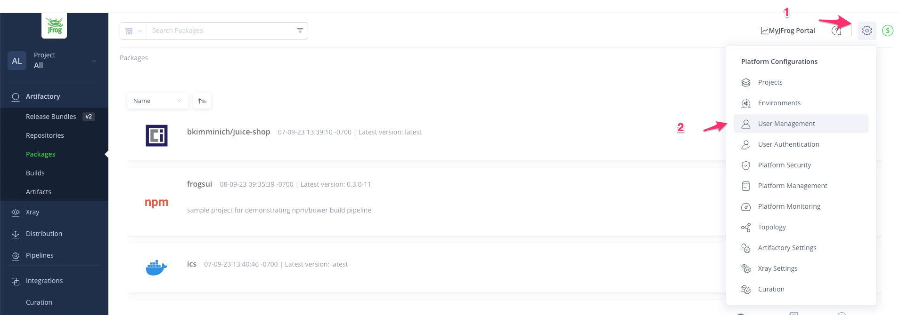
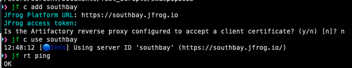

## JFrog CLI setup
### Installation & validation
  * Install JFrog CLI - https://jfrog.com/getcli/
  * Easiest option - `brew install jfrog-cli` 
  * Check and confirm the install - `jf -v`

### Configuration with JFrog instance
  * Add a config - `jf config add`
  * Choose a server ID: {unique name} Ex: `swampup`
  * JFrog platform url: `{your Jfrog instance url}` Ex: https://southbay.jfrog.io
  * JFrog access token (Leave blank for username and password/API key): `{access token}`
  * To create an access token, navigate on the UI to Administration > User management > Access Tokens > Generate token
      or
  * JFrog username: `{username}`
  * JFrog password or API key: `{password}`
     
    
     
  * Is the Artifactory reverse proxy configured to accept a client certificate? (y/n): `n`
  * Use the configured instance - `jf config use {server ID}` Ex: `jf config use swampup`

 

* Health check - `jf rt ping`
   
   
  

