## Curation lab
### Pre-requisites:
  * Latest [npm client](https://docs.npmjs.com/downloading-and-installing-node-js-and-npm)

### On the UI
  * Let’s create a new npm remote repo:
    * Navigate to Admin panel > Repositories > Repositories.
    * Click on Add Repositories at the top right, select Remote Repository and  pick type ‘npm’
    * Type the repo name 'npm-remote-curation' in the Repository Key field and hit Create Remote Repository 

 

  * Let’s turn on Curation:
    * Navigate to Admin panel > Curation > General and turn on Curation
     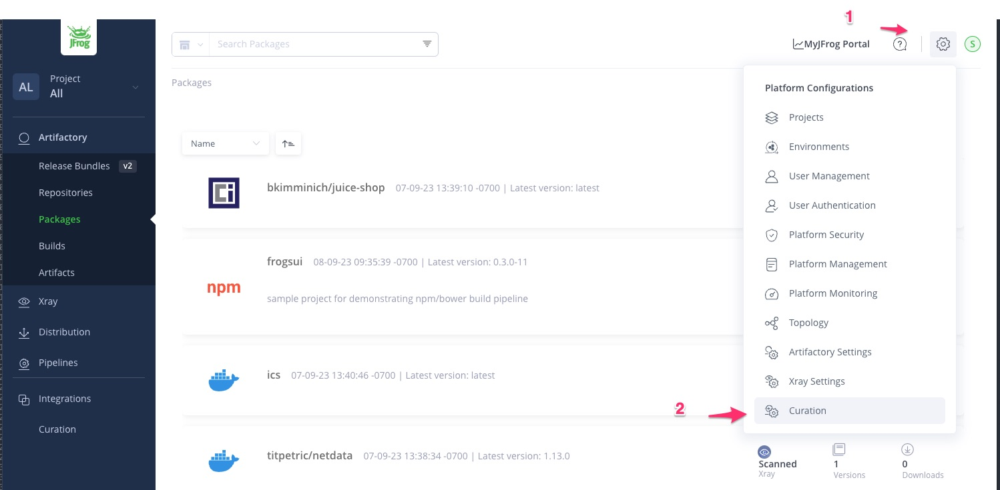curation" width="600" height="300">
     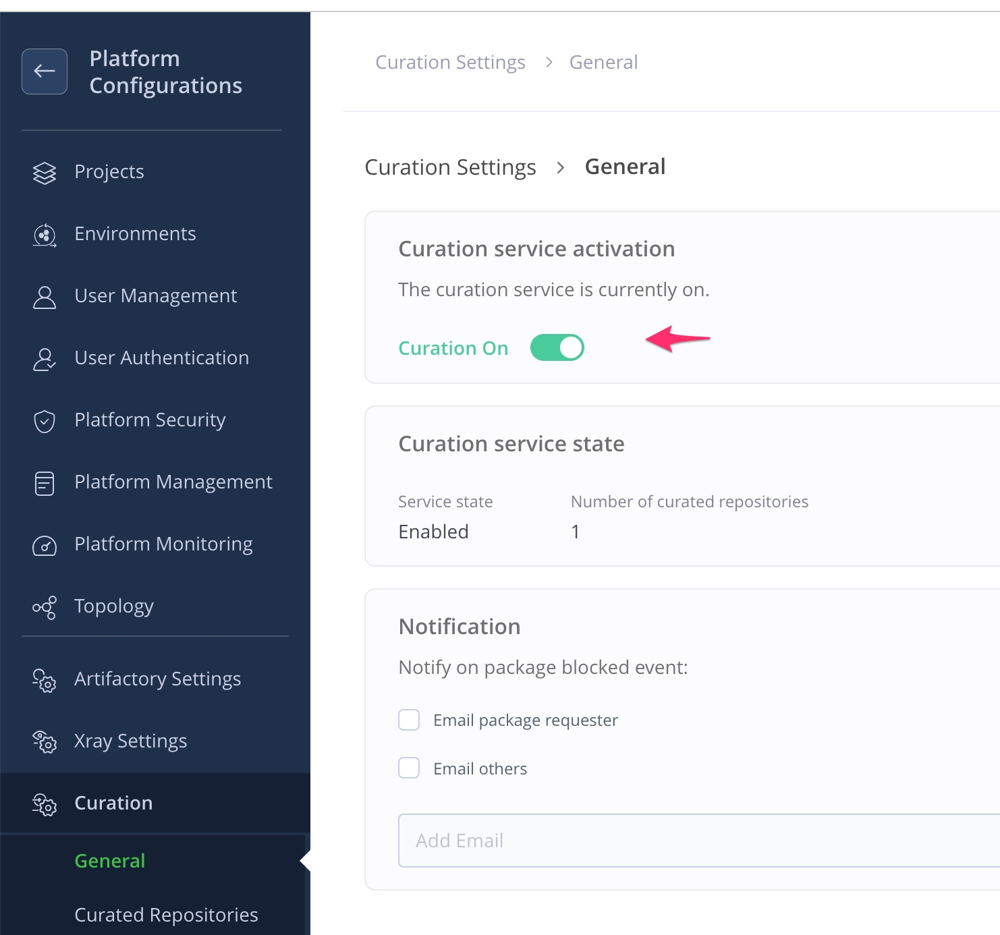
       
    * Navigate to Admin panel > Curation > Curated repositories and turn on the State option on the just created 
      'npm-remote-curation' repository
    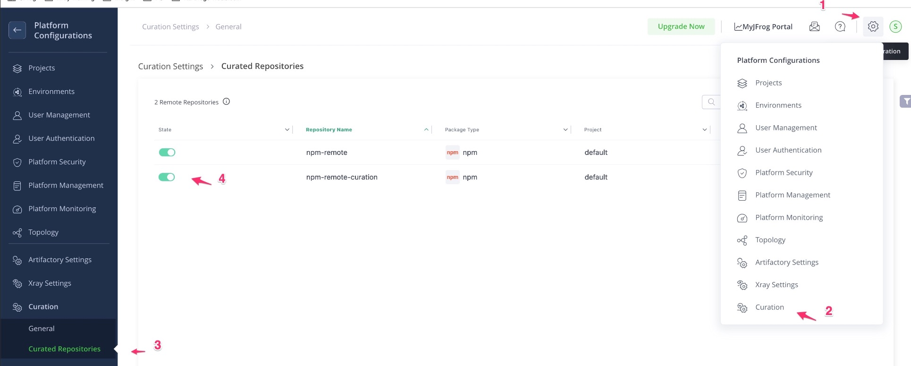
    

 

  * Let’s create a Curation policy:
    * Navigate to Application panel > Curation > Policies management
      * Click on `Create New Policy` ( if this is the first policy) or `Create Policy` at the top right
      * Give the Policy the name `'block malicious pkgs'` and click `Next`
      * Select the just created repo by selecting `Specific` and then pick the repo 'npm-remote-curation' 
      and click `Save` then click `Next`
      * Select the first condition in the list called `‘Malicious package’` then click `Next`
      * Leave the waivers section blank then click `Next`
      * In the Actions section, pick `‘Block’` then click `Next`
      * Click on the `Save Policy` button
       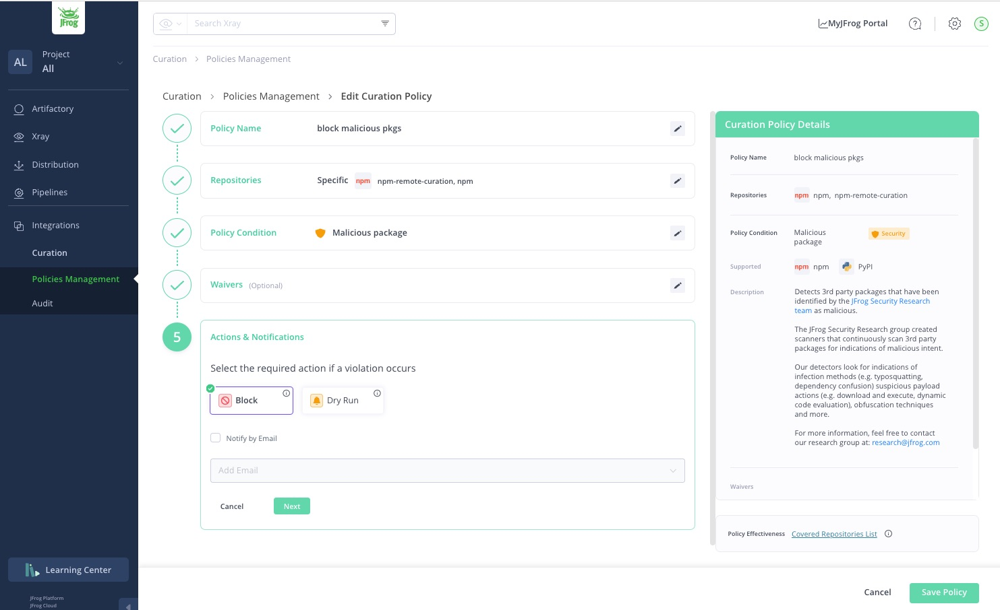
     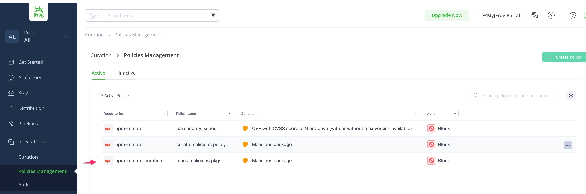
     
      
 

### In the terminal
  * Let’s configure the npm client:
      * Navigate to Applications panel > Artifactory > Artifacts
      * Find the `npm-remote-curation` repo you just created in the list
      * Click on it and then click on the `Set Me Up` button at the top right
      * In the Configure tab `Enter your credentials` and click on `"Generate Token & Create Instructions"`
        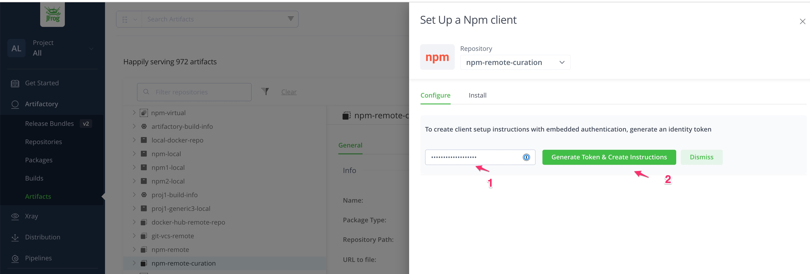
      * Copy the command in the instructions to set the default npm registry with an Artifactory npm repository and 
        run  in your terminal to config your npm client . Then paste the `basic authentication` information into 
        your ~/.npmrc file when using unix (or if using Windows the %USERPROFILE%/.npmrc)
 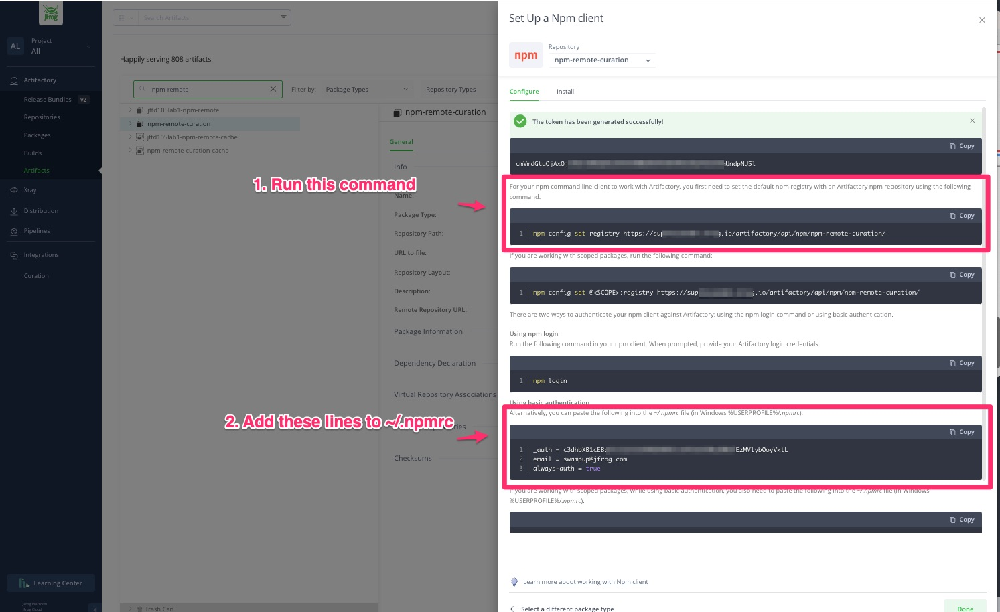 

      * Finally your ~/.npmrc file will have content similar to the following
         
        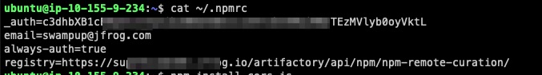
         

* Run `npm install cors.js` - An example of a malicious pkg
  
**Note:** On Mac  if you are  prompted by   the above command to fix it by running `npm config fix` , then run that .
 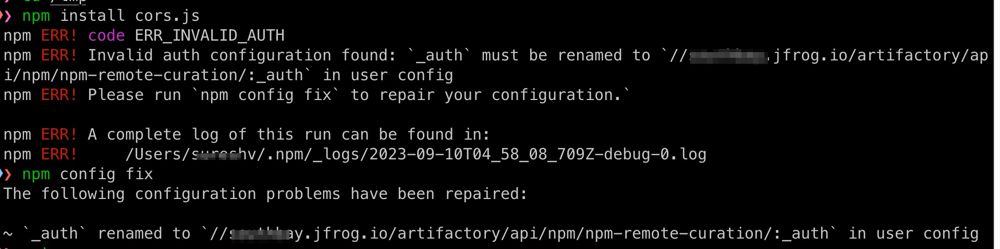
 
After you run `npm config fix`  the `_auth` in the ~/.npmrc is  prefixed by the fully qualified `npm-remote-curation` repo path as shown below:

 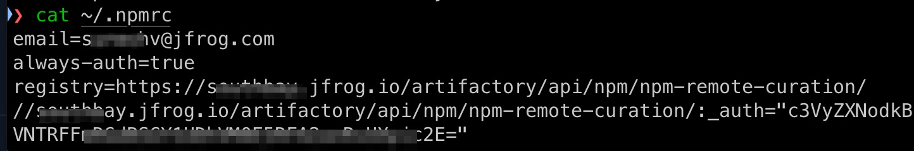
  
Then when you  rerun the `npm install cors.js`.
* Check if the command fails
 
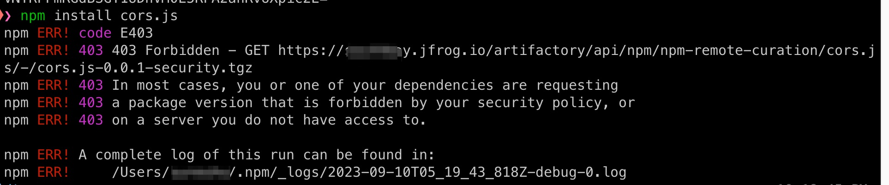
 

* Run `npm install cors` - an example of a non-malicious pkg
  * Check for success

