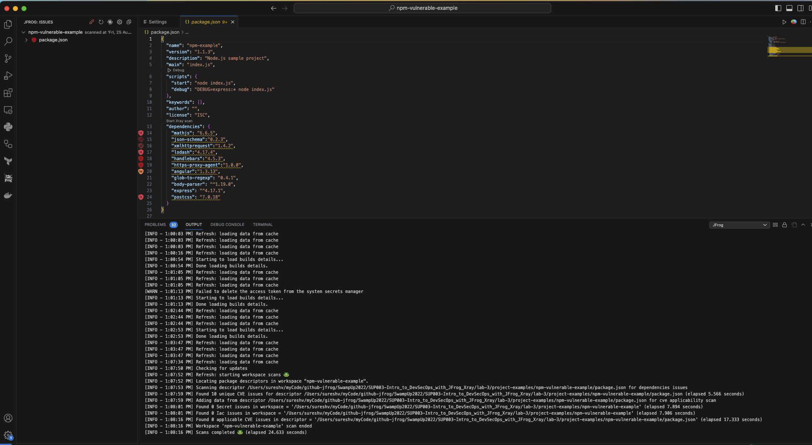
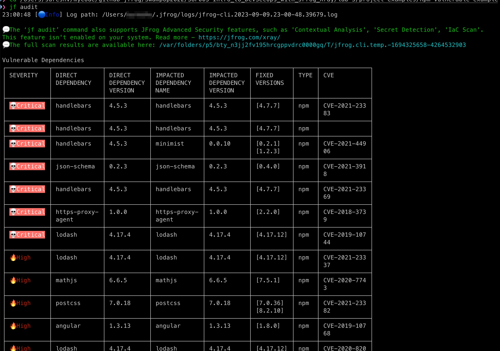
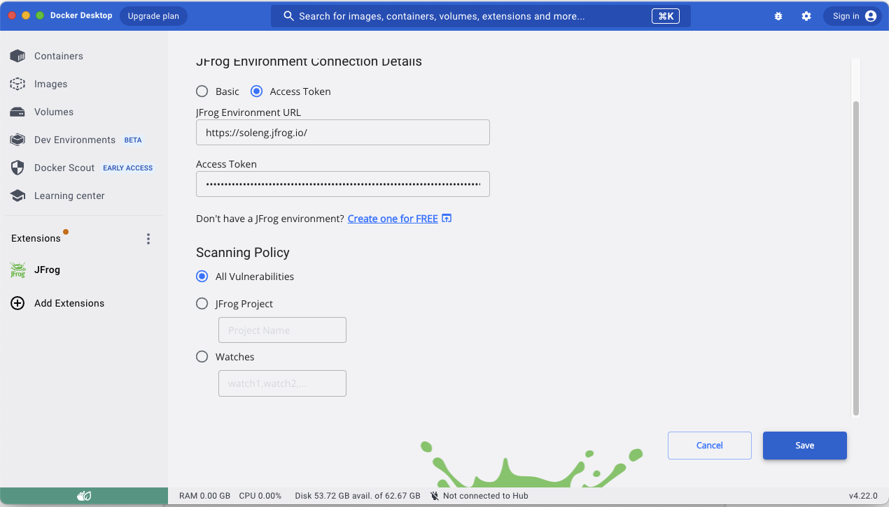
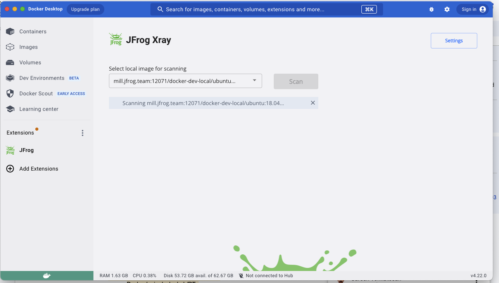
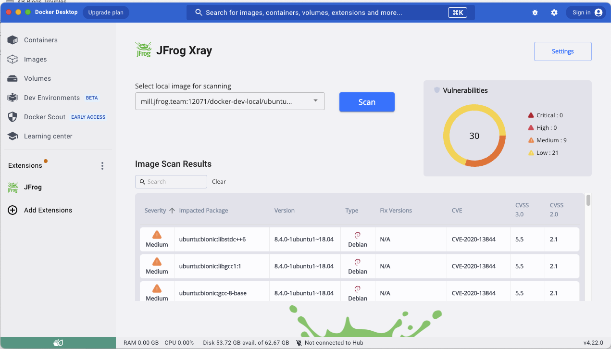

## IDE plugin scan:
  * Pre-requisites:
     * VS Code IDE
  * Open npm-vulnerable-example project in the folder example on VS Code
  * Install The Jfrog extension in VS Code  as mentioned in [JFrog - Visual Studio Marketplace](https://marketplace.visualstudio.com/items?itemName=JFrog.jfrog-vscode-extension)
    * Navigate to Extension tab and look up JFrog > Click Install
    * Configure Jfrog extension of VS Code - provide the instance url and credentials
    * Once all set, navigate to the JFrog extension and run the scan
    * Check and validate the results
      
    
 

## CLI dependency scan:
  * Pre-requisites:
    * JFrog CLI installed and configured

 

* On the terminal:
  * Go to the root of the npm project
  * Run `jf audit`
  * Validate the scan results
    

## Docker Desktop extension scan
  * Pre-requisites:
    * Docker Desktop
    * Docker image that is present locally
      * If none, run docker pull nginx:latest

 

  * On Docker Desktop , [install JFrog extension](https://hub.docker.com/extensions/jfrog/jfrog-docker-desktop-extension)
  * Configure the extension with JFrog instance by providing instance url and credentials
  
  * Choose an image and click scan
    
  * Validate results
    

 

## Frogbot scan - optional
- Fork this project on github - https://github.com/omerzi/frogbot_demo_pypi
- Examine the 2 files in the path - .github/workflows
- frogbot-pr-scan.yml file is for scanning Pull Requests for any vulnerabilities
- frogbot-scan-and-fix.yml is for scanning the git repository for any vulnerabilities
- Let’s do some initial configuration:
  - Navigate to Settings > Environment and create a new environment called frogbot
  - Navigate to Settings > Secrets and Variables > Actions and create the following 2 secrets:
    - JF_URL - provide your instance url
    - JF_ACCESS_TOKEN - provide an access token from your instance
  - Navigate to Settings > Actions > General and scroll to the bottom of the page
    - Make sure the checkbox Allow github to create and approve pull requests is selected

 

- Let’s create a PR with a change in dependency:
  - Navigate to Code and open requirements.txt file in the project root
  - Click Edit on top right and change the version of the dependency PyYaml to 5.2
  - Click commit changes and select the 2nd option in the list ‘Create a new branch for this commit and start a pull request’
  - Provide an appropriate branch name like ‘vuln-branch’ and click on Propose changes
  - Then click on Create Pull request
  - Wait a few seconds for some tasks/checks to be triggered until you get the message - “Frogbot Scan Pull Request / scan-pull-request (pull_request_target) Waiting”
  - Click on Details next to the message
  - Then click on Review pending deployments
  - Select the checkbox next to frogbot and click on Approve and deploy
  - The action workflow is triggered. Wait until the workflow is done
  - Once the workflow is completed, navigate to Pull requests and select the PR that was just created
  - Find and examine the scan result highlighting the vulnerability impacting PyYaml v5.2 

