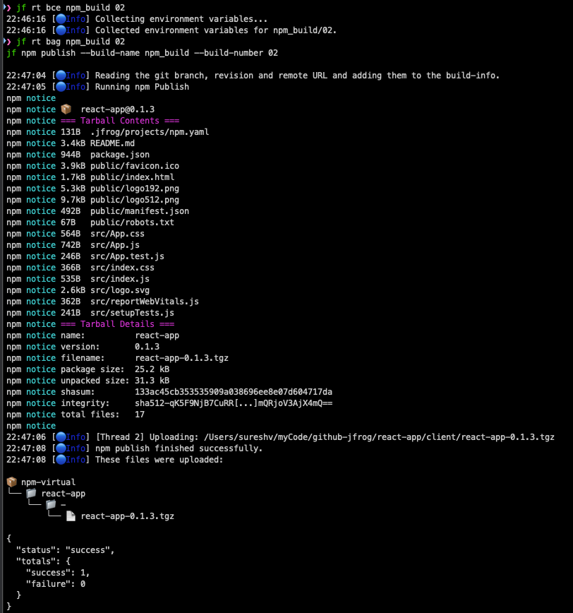
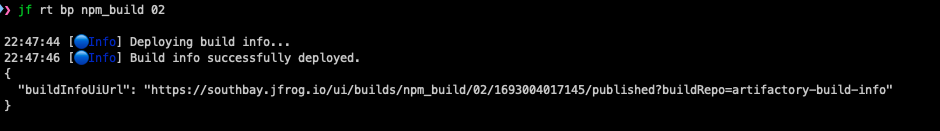
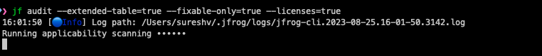
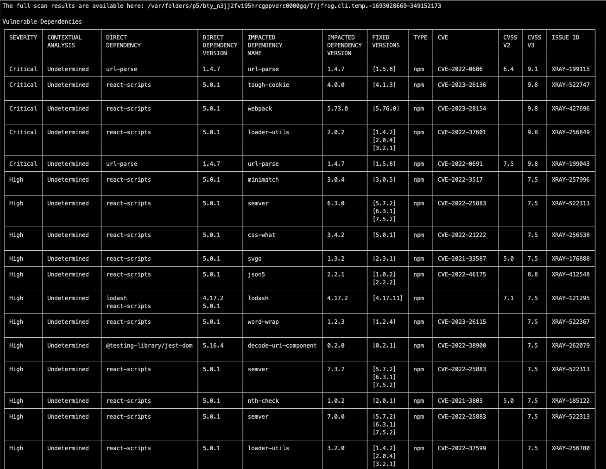
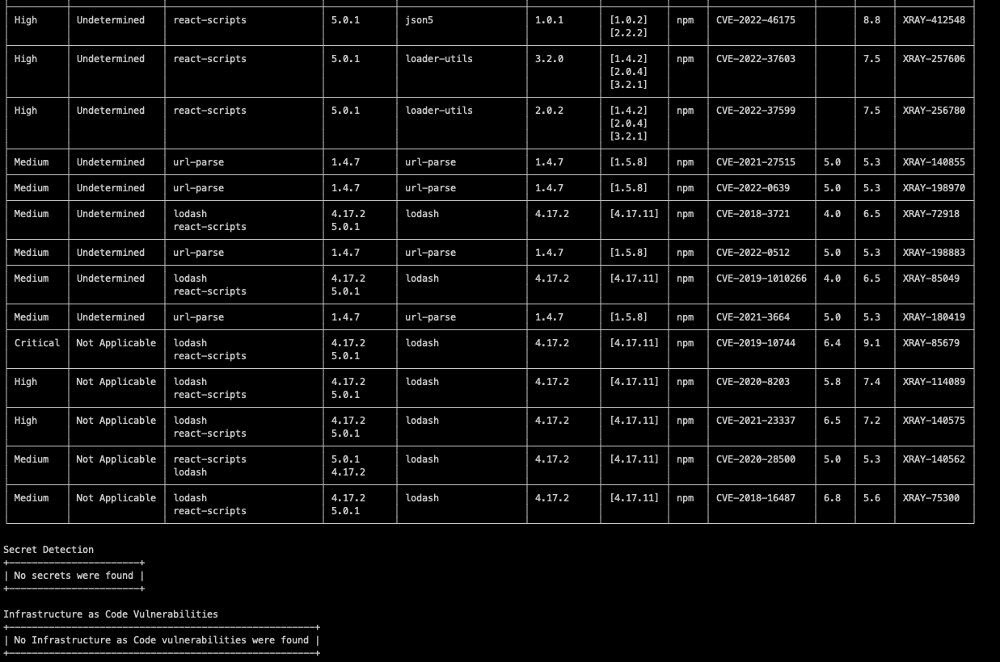
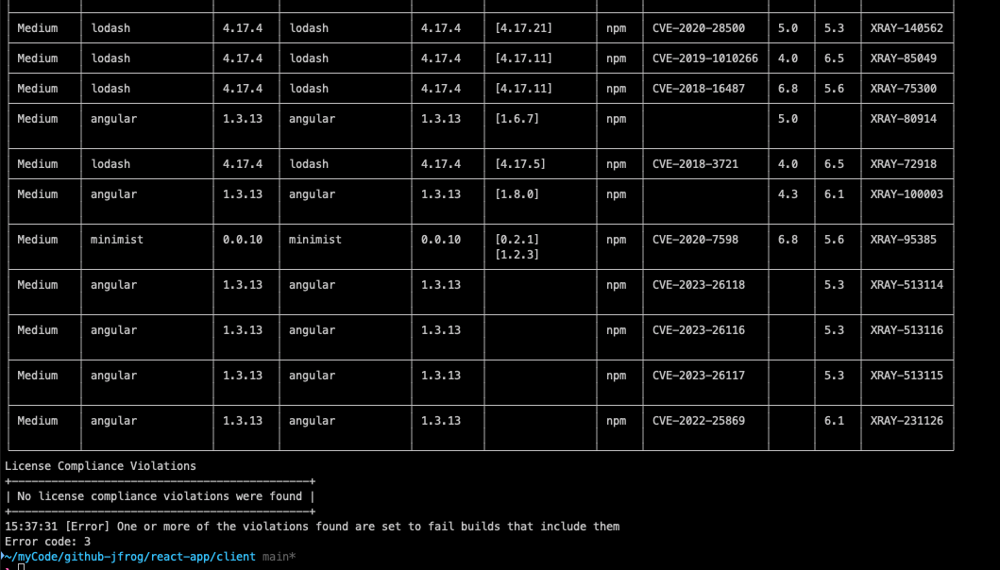

## Xray Scan Lab
- Pre-requisites:
  - Navigate to the root of the npm project located in the [example](example) folder, specifically at 
    `SwampUp2023/JFTD101-Evolving-from-DevOps-to-DevSecOp/lab3-Xray-Scan/example/react-app`.
  - JFrog CLI installed and configured with the JFrog instance

<br/>

- On the UI:
  - Navigate to Admin tab > Repositories > Add repositories
  - Create a npm local repository -- `npm-local`
  - Create a npm remote repository -- `npm-remote` proxying npm registry
  - Create a npm virtual repository -- `npm-virtual`, include the above npm local and remote repos to be part of this virtual and then select the local repo to be the ‘default deployment repository’
  - Turn on indexing of the repositories
    - Xray > Indexed resources > Add a repository > Select your repo in the left column and bring it over to the right column > Save

<br/>

- On your local: 
  - get to the `root` of the `react-app` npm project under `'example'`
    - cd `react-app`
  - Lets publish a dummy build to the instance
    - `jf rt bp npm_build 01`
  - Verify the build info publish on the instance
    - Artifactory > Builds. Verify the just published build info
  - Turn on indexing of the build
    - Xray > Indexed resources > Builds > Add a build > Select your build in the left column and bring it over to the right column > Save
  - From the root of the project
    - Npm package manager integration
      - Run `jf npmc`
      - Resolve dependencies from Artifactory? (y/n)? Y
      - Set Artifactory server ID [swampup]: hit Return
      - Set repository for dependencies resolution (press Tab for options): use Tab to select the virtual repository 
        `npm-virtual` and hit Return
      - Deploy project artifacts to Artifactory? (y/n)? Y
      - Set Artifactory server ID [swampup] hit Return
      - Set repository for artifacts deployment (press Tab for options): use Tab to select the virtual repository 
        `npm-virtual` and hit Return
    - Npm install and build
      - `jf npm install –build-name npm_build –build-number 02`
    - Publish the built npm pkg to Artifactory
      - `jf npm publish –build-name npm_build –build-number 02`
    - Collect environment variables
      - `jf rt bce npm_build 02`
    - Collect information regarding git
      - `jf rt bag npm_build 02`
        <br/>
           
    - Publish build info
      - `jf rt bp npm_build 02`
        <br/>
        
    - Verify the published build info on the instance and check the scan details in Builds > npm_build > 02 > Xray data
    - Scan the build info on your local by Xray - optional
      - `jf bs npm_build 02 –vulns`
    - Run jf audit - optional
      - `jf audit --extended-table=true --fixable-only=true --licenses=true`
        <br/>
        
        
        
    - You can capture the output of the jf command, including any error messages or codes it produces, and then 
      process that output in a script. 
      - Here's how you might do it using Bash scripting as an example:
        <br/> Note: The 2>&1 syntax redirects the standard error stream to the standard output stream so that both 
        streams are captured in the output variable.
```text
output=$(jf bs npm_build 03 --extended-table=true --fail=true 2>&1)
error_code=$?

echo "Command output:"
echo "$output"
echo "Error code: $error_code"
```
<br/>




