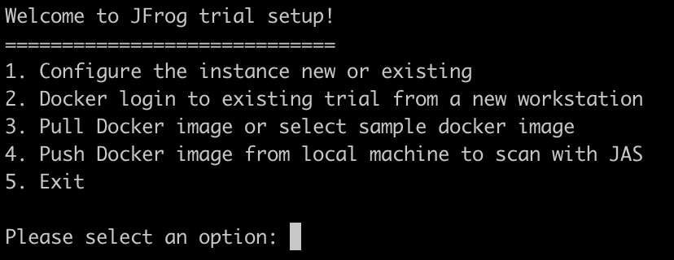
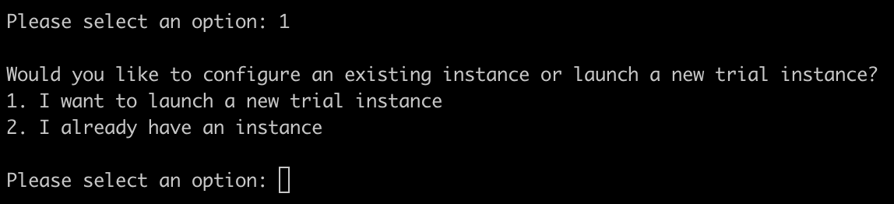
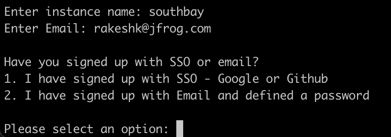
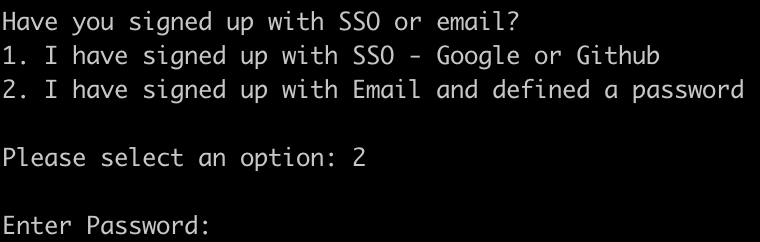
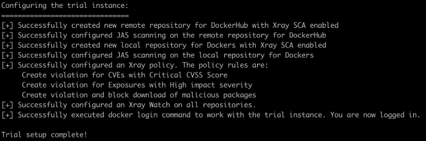

## JFrog Advanced Scan lab
- Pre-requisites:
  - Pls make sure Docker Desktop is running on your local machine

 

### Initial setup
- Download the script (zip file) from here  
    - https://releases.jfrog.io/artifactory/website/security/guided-trial.zip
    - Then manually unzip it

 

- You can also download it directly from your terminal using the following commands: 
  - `curl -sLO https://releases.jfrog.io/artifactory/website/security/guided-trial.zip`
  - Then run - `unzip guided-trial.zip -d guided-trial`

 

### Script execution
- From the root folder, run
  - `bash guided-trial/linux_guided_trial.sh`

 

 

- From the menu, select option #1 - Configure the instance new or existing
   

- Select option #2 - I already have an instance
- Enter your instance name - {instance_name} and email address used
   
- Select option #2 and provide your password
   
- Notice the script’s outputs as it configures your instance environment
  - This   will create the following:
    - Remote repo  "docker-hub-remote-repo" to proxy cache "https://registry-1.docker.io/ with xray indexing on, jas on.
    - local docker repo with "local-docker-repo"  with xray indexing on ,  jas on.
    - Security policy "Security_policy"
    - Security watch "Security_watch"
       
- On your instance, check and find `docker-hub-remote-repo` remote repository and `local-docker-repo`local repository created
  - These repos will be used ahead to pull an image from dockerhub/push an image from your local machine
- From the menu, select option #3 - `Pull Docker image or select sample docker image`
- Now select option #1 - `Pull OWASP Webgoat -Good example of Contextual Analysis value`
  - Note the docker image being pulled from dockerhub to your local machine through Artifactory
  - Once cached within Artifactory, the scans are also done. This may take a few minutes ...
  - Once done, a new browser tab opens up that takes you to the scan results
- On the UI, click on the image to view the scan results
- Navigate to Security issues > Vulnerabilities to find the list of all vulnerabilities detected by the scan
- Have a look at the CVE - `CVE-2022-22965`
  - Is it applicable to this docker image?
  - What is the risk?
  - What is the remediation process?
- Now, have a look at the CVE - `CVE-2019-12900`
  - Note the CVSS score of 9.8
  - Why is this not applicable to this docker image?
- How many `Critical` yet `Not Applicable` vulnerabilities were detected by the scan?

 

- Have a look at the other tabs too:
  - Secrets
  - Application exposures
  - Service exposures

 

- Now select option #2 - `Pull netdata`
- Repeat the above steps for this image's scan results too

 

- Other images that can be pulled from dockerhub that show interesting results:
  - `mvila/npm-addict:production` - this has a malicious package
  - `nginxdemos/hello:latest` - this has a services exposure

 

- ---Optional step---
- Select option #4 - `Push Docker image from local machine to scan with JAS`
  - Select a docker images from the list of available images on your local machine and push it
  - Notice how the image gets pushed to Artifactory and then the scans are also done. This may take a few minutes ...
  - Once done, a new browser tab opens up that takes you to the scan results

