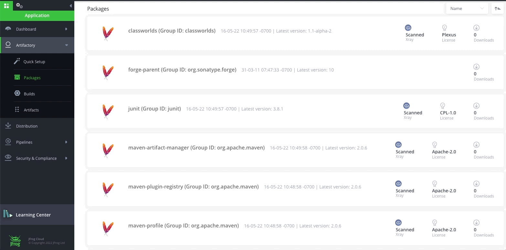
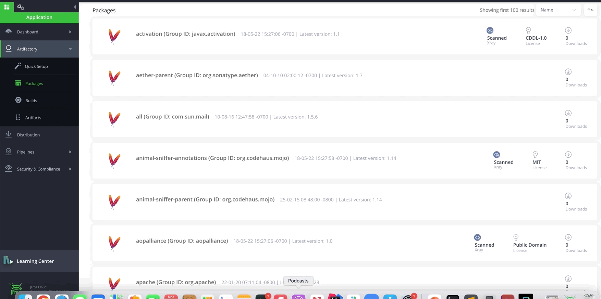
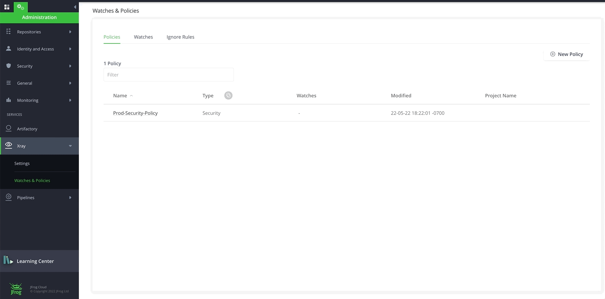
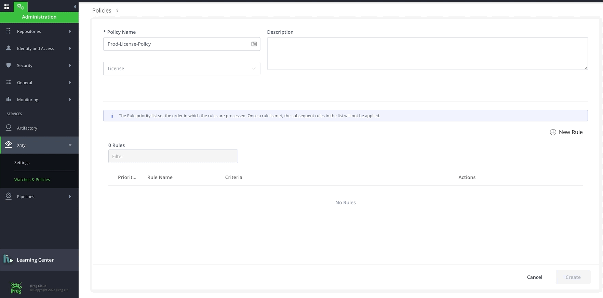
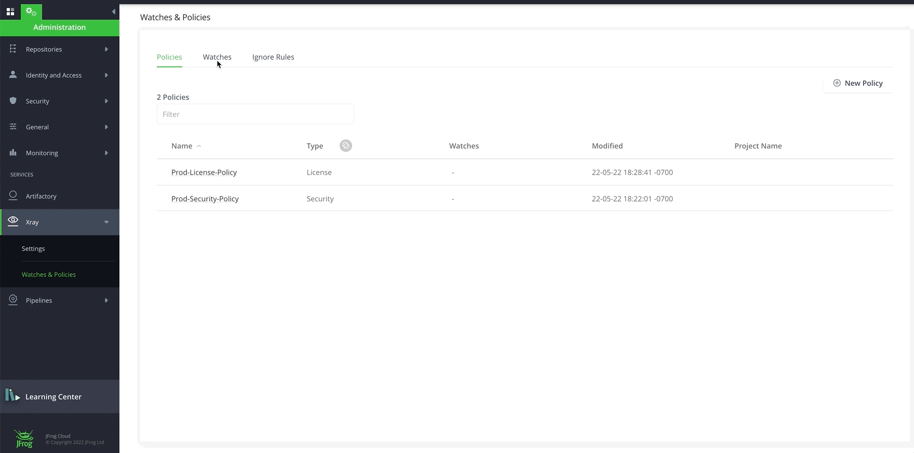

# LAB 5 - JFrog Software Supply Chain Security

## Prerequisites
- Lab-0 - Configure JFrog CLI
- Lab-1 - Repository Provisioning
- Lab 3 - Build, Properties and Replication
- Locally cloned Github [Project](https://github.com/jfrog/SwampUp2023/tree/main/JFTD103-JFrog_Platform_Automation) where IDE is installed.
- Preferred IDE (Integrated Development Environment) like [Intellij](https://www.jetbrains.com/idea/download/?section=mac#section=mac), [VSCode](https://code.visualstudio.com/download)

## Overview of Lab 5
- Basic Configuration [ Index Resources(Repositories, Builds), Policy and Watch ]
- Shift-Left [ IDE, Dependencies Scan, On-demand Scan, Docker Desktop, Frogbot ]
- JFrog Advanced Security [ Contextual Analysis, Secret, IaC Analysis, Application Lib Misuse, Service Config Security ]
- Curation
- Scan Builds
- Reports [ SBOM, Violations, Vulnerabilities, Licenses Due Diligence, Operational Risk, Exposure ]

<br/>
<br/>

## INDEX REPOSITORIES
### INDEX REPOSITORIES using AUTOMATION 
- Run
```
  jf xr curl -XPUT "/api/v1/binMgr/1/repos" -H "Content-Type: application/json" -d "@index-repos.json"
  
```

<br/>

### INDEX REPOSITORIES using UI [Optional]

- Login to your saas instance **{{instance_name}}**.jfrog.io with  your admin credentials

- Navigate to the **Administration** Module, **Xray** and click on Settings then **Indexed Resources**

- Add the **Repositories** resources to get indexed

  

<br/>
<br/> 

## INDEX BUILDS
### INDEX BUILDS using AUTOMATION 
- Run
```
  jf xr curl -XPUT "/api/v1/binMgr/1/builds" -H "Content-Type: application/json" -d "@index-builds.json"
```

<br/>

### INDEX BUILDS using UI [Optional]
- Add **Builds** resources to get indexed

  


<br/>
<br/>
<br/>

## CREATE SECURITY POLICY
### CREATE A SECURITY POLICY using AUTOMATION 
- Run
```
  jf xr curl -XPOST "/api/v2/policies" -H "Content-Type: application/json" -d "@prod-sec-policy.json"
```
- With Severity - CRITICAL, HIGH, MEDIUM, LOW with different action items
- Confirm Security Policy named with ``prod-security-policy`` is created

<br/>

### CREATE A SECURITY POLICY using UI [Optional]
- Navigate to the **Administration** Module, expand the **Xray** menu at the bottom and click on **Watches & Policies** menu item.
- Click on **Create a Policy** and let's create our first **Security** policy called **"prod-security-policy"**

  

<br/>

- Click on **New Rule** to add rules to **prod-security-policy**. Add the following rule with **Criteria** and **Automatic Actions**. A default Automatic Action of Generate Violation is enabled for every Rule. Click **Save** and Click **Create**.
    * **Rule name**: high
    * **Criteria**: Minimum Severity: High
    * **Automatic Actions**:
        * Notify Deployer
        * Block Download
        * Fail Build

  

<br/>
<br/>
<br/>

## CREATE LICENSE POLICY
### CREATE A LICENSE POLICY using AUTOMATION
- Run
```
  jf xr curl -XPOST "/api/v2/policies" -H "Content-Type: application/json" -d "@prod-lic-policy.json"
```
- Confirm License Policy named with ``prod-license-policy`` is created

<br/>

### CREATE A LICENSE POLICY using UI [Optional]
- Click on **New Policy**. Let's create a **License** policy with **"prod-license-policy"** name.

  

<br/>

- Click on **New Rule** to add rule to **prod-license-policy**. Add a Rule for banned licenses with **Criteria** and **Automatic Actions** below. Click **Save** and Click **Create**.
    * **Rule name**: banned
    * **Criteria**: Banned Licenses: "BSD 2-Clause, GPL-3.0"
    * **Automatic Actions**:
        * Notify Deployer
        * Block Download
        * Fail Build

  

**NOTE:** You may have noticed that Fields under **Criteria** are different for **License Policy** and for **Security Policy**.

<br/>
<br/>
<br/>

## CREATE Operational Risk POLICY
### CREATE AN Operational Risk POLICY using AUTOMATION
- Run
```
  jf xr curl -XPOST "/api/v2/policies" -H "Content-Type: application/json" -d "@prod-operational-risk-policy.json"
```
- Confirm License Policy named with ``prod-license-policy`` is created

<br/>
<br/>
<br/>

## CREATE WATCH
### CREATE WATCH using Automation
- Run
```
  jf xr curl -XPOST "/api/v2/watches" -H "Content-Type: application/json" -d "@prod-watch.json"
```
- Confirm Watch named with `prod-watch` is created

<br/>

### CREATE WATCH using UI
- Navigate to the **Administration** Module, expand the **Xray** menu at the bottom and click on **Watches & Policies** menu item.
- Click on the Watch tab and create a new watch name `prod-watch`.
- Under Manage Resources, add the repositories by clicking on the **Add Repositories** button
- Add the two builds `payment-maven` and `auth-npm` by clicking on the **Add Builds** button.
- Add the `prod-security-policy` and `prod-license-policy` that we just created by clicking on the **Manage Policies** button.

  

<br/>
<br/>
<br/>

# Shift Left 
## IDE PLUGIN
- The cost of remediating a vulnerability is akin to the cost of fixing a bug. The earlier you remediate a vulnerability in the release cycle, the lower the cost.
- The IDE integration completes the CI/CD process, by bringing Xray's issue discovery one step earlier, to development time.

| IDE  | Supported Packages |
| ------------- | ------------- |
| [Visual Studio Code](https://marketplace.visualstudio.com/items?itemName=JFrog.jfrog-vscode-extension) | Maven, Pypi, npm, NuGet, Go |
| [Intellij](https://jfrog.com/help/r/jfrog-integrations-documentation/jfrog-intellij-idea-plugin) | Maven, Pypi, npm, Gradle, Go |
| [WebStorm](https://jfrog.com/help/r/jfrog-integrations-documentation/jfrog-intellij-idea-plugin) | npm | 
| [PyCharm](https://jfrog.com/help/r/jfrog-integrations-documentation/jfrog-intellij-idea-plugin) | Pypi |
| [GoLand](https://jfrog.com/help/r/jfrog-integrations-documentation/jfrog-intellij-idea-plugin) | Go |
| [Android Studio](https://jfrog.com/help/r/jfrog-integrations-documentation/jfrog-intellij-idea-plugin) | Gradle |
| [Visual Studio](https://www.jfrog.com/confluence/display/JFROG/JFrog+Visual+Studio+Extension) | NuGet |
| [Eclipse](https://www.jfrog.com/confluence/display/JFROG/JFrog+Eclipse+IDE+Plugin) | Maven, npm, Gradle |
| [Theia](https://open-vsx.org/extension/JFrog/jfrog-vscode-extension) | Maven, Pypi, npm, NuGet, Go |

<br/>

### SETUP IDE PLUGIN
- Open one of the above IDE and install plugin/extension called `JFrog`.
- Configure plugin against the JFrog Platform by providing `JFrog Platform URL`, `Username`, `Password` or `Access Token`
- Open either `npm-example` or `maven-example` project from `example` 
  - Run `npm install` or `mvn clean install` (NOTE: make sure your native client is pointing to Artifactory instance to download dependencies)
- Open `JFrog` tab and review list of vulnerabilities 

<br/>
<br/>

## DEPENDENCIES SCAN
- With this feature, before a developer even checks-in the code they can scan using JFrog CLI for security or license violations saving valuable time to address these issues.
- Navigate to either `npm-example` or `maven-example` project from `example`
- Run `jf npmc` or `jf mvnc`
- Run `jf audit` or `jf aud` (NOTE: we can also pass additional command like `--dep-type`, `--watches`, `--project`, `--repo-path`, etc)
    - Supported package types: Maven, Gradle, npm, Pip, Pipenv, Go, Nuget, .NET core CLI, Yarn2
- Run the scan command with the relevant command options. You can view scan results for the following:
    - Vulnerabilities, Violations, License
- List output into table format as DEFAULT `--format=json|table`
- More Information on [Dependencies Scan](https://jfrog.com/help/r/jfrog-cli/scanning-project-dependencies)

<br/>
<br/>

## ON-DEMAND BINARY SCAN
- Xray uses the JFrog CLI to provide **on-demand binary scanning** to address:
    - Run ad-hoc scans for security purposes **without uploading to Artficatory first**.
    - Adhere to organizational standards, whereas binaries and builds need to be **approved** first before uploading to Artifactory.
    - Not all binaries are stored in Artifactory, and as a user, you want to use Xray scanning capabilities.
- Navigate to `JFTD103-JFrog_Platform_Automation/lab-4-AQL/sample-data` and use either `npm` or `maven` project which has `.jar` or `.tgz`
- Run `jf scan` or `jf s`
    - sample (maven or npm) files are located under `JFTD103-JFrog_Platform_Automation/lab-4-AQL/sample-data/`
- For Docker, Run `jf docker scan` (NOTE: we can also pass additional command like `--watches`, `--project`, `--repo-path`, etc)
- For scan binary locally, Run `jf s "path/to/files/"` (NOTE: we can also pass additional command like `--watches`, `--project`, `--repo-path`, etc)
- More Information on [on-demand binary scan](https://jfrog.com/help/r/jfrog-cli/on-demand-binary-scan)

<br/>
<br/>

## DOCKER DESKTOP EXTENSION [Optional]
- Download Docker Desktop application
- Install [JFrog Extension](https://hub.docker.com/extensions/jfrog/jfrog-docker-desktop-extension)
- Configure Extension pointing to your JFrog Platform instance
- Now we can scan any of the docker image that we have locally and see Xray scan results
- More Information on [Docker Desktop Extension for JFrog Xray](https://jfrog.com/solution-sheet/docker-desktop-extension-for-jfrog-xray/)

<br/>
<br/>

## FROGBOT
- [Frogbot](https://github.com/jfrog/frogbot) is a Git (GitHub, GitLab, Bitbucket) bot that **scans your pull requests** and repositories for security vulnerabilities and adds the scan results as a comment on the pull request.
    - Supported Packages : Maven, Gradle, NPM, Pip, Pipenv, NuGet, Go, .Net, Yarn
    - [Here](https://github.com/jfrog/frogbot/tree/master/docs/templates) are the sample templates for scan pull request in GitHub
- Frogbot can also **open a pull requests** for upgrading vulnerable dependencies to a version with a fix.
    - Supported Packages : Maven, NPM, Pip, Pipenv, Go, Yarn
    - [Here](https://github.com/jfrog/frogbot/tree/master/docs/templates) are the sample templates to open pull request based on scan for fix
- Install [Frogbot](https://github.com/jfrog/frogbot/tree/master/docs) to your repositories
- Fork github project either
  - [python-catalog](https://github.com/MaharshiPatel/python-catalog) and clone on your machine
  - [npm-example-swampup](https://github.com/MaharshiPatel/npm-example-swampup) and clone on your machine

  - navigate to file `.github/workflows/`
      - We need to add repository secrets in Github (#2 in [document](https://github.com/jfrog/frogbot#%EF%B8%8F-installing-and-using-frogbot))
          - `JF_URL` 
          - `JF_USER` & `JF_PASSWORD` or `JF_ACCESS_TOKEN`
          - `JF_GIT_TOKEN` (line 53)
      - Check the allow GitHub Actions to create and approve pull requests check box (#3 in [document](https://github.com/jfrog/frogbot#%EF%B8%8F-installing-and-using-frogbot))
      - Create a Github Environment called `frogbot` (#4 in [document](https://github.com/jfrog/frogbot#%EF%B8%8F-installing-and-using-frogbot))
- Fork github project [frogbot_demo_pypi](https://github.com/MaharshiPatel/frogbot_demo_pypi) and clone on your machine

<br/>
<br/>
<br/>

# JFROG ADVANCED SECURITY
## Vulnerability Contextual Analysis
- JFrog Security and the JFrog research team's continuous effort to enhance security is introducing an additional capability: [Vulnerability Contextual Analysis](https://jfrog.com/help/r/jfrog-security-documentation/vulnerability-contextual-analysis). JFrog Xray previously released a powerful capability, the [JFrog Security CVE Research and Enrichment](https://jfrog.com/help/r/jfrog-security-documentation/jfrog-security-cve-research-and-enrichment) feature, that helps you with enhanced analysis on CVE findings in a way that allows you to focus on the most important issues with the capability of finding the best resources invested in fixing them. Vulnerability Contextual Analysis is an extension to that capability, ensuring Xray's analysis findings are as focused as possible.
- Review in IDE and in UI under [Scan List](https://jfrog.com/help/r/jfrog-security-documentation/xray-scans-list)
- Vulnerability Contextual Analysis Statuses 
  - Not applicable: The vulnerability is not applicable 
  - Applicable: The vulnerability is applicable 
  - Undetermined - not triggered: An admin needs to enable this feature. 
  - Undetermined – analysis in progress: If Xray is in the process of analyzing the vulnerability applicability, it is indicated in the vulnerability details as analysis in progress. 
  - Undetermined - inconclusive: Xray was unable to determine if the vulnerability is applicable or not. 
  - Undetermined - no scanner: An applicability scanner for this vulnerability is not available.

- Navigate to either of `npm` or `maven` project under `example` in IDE or terminal
  - In IDE, navigate to JFrog Extension and run scan
  - In terminal, run `jf audit`

<br/>
<br/>
<br/>

## Secrets Detection
- Detects any secret left exposed in the artifacts stored in Artifactory to stop any accidental leak of internal tokens, credentials, or use of expired certificates.
- Navigate to either of `npm` or `maven` project under `example` in IDE or terminal
  - In IDE, navigate to JFrog Extension and run scan
  - In terminal, run `jf audit`
  
<br/>
<br/>
<br/>

## Application Libraries Misuse
- Detects whether common OSS libraries and services are used securely by the application.
- Examples 
  - Insecure use of credentials (insecure key storage)
  - Enforcement of secure communication (redirecting HTTP to HTTPS, enforcing TLS, verifying the TLS certificates of all servers in Python scripts, enforcing TLS version, using secure HTTP headers)
  - Use of weak crypto keys 
  - Throttle logins to prevent brute-force attacks (Throttle Node.js logins to prevent brute-force attacks)
  - Invoking Node.js exec functionality with user-provided input
- Navigate to either of `npm` project under `example` in IDE or terminal
- Run `docker login -u${{USER}} ${{JPD_HOST}}` <- Command can be copied from UI -> `Artifactory` -> `Repositories` or `Artifacts` -> select `finapp-docker-dev-virtual` -> `**Set Me Up**`
- Run `docker build . -t finapp-docker:1.0 --secret id=npmrc,src=$HOME/.npmrc`
- Run `docker tag finapp-docker:1.0 ${{JPD_HOST}}/finapp-docker-dev-virtual/finapp-docker:1.0`
- Run `docker push ${{JPD_HOST}}/finapp-docker-dev-virtual/finapp-docker:1.0`

<br/>
<br/>
<br/>

## Services Configuration Security
- Detects whether common OSS libraries and services are configured securely, so an application can be easily hardened by default.
- Examples
  - Insecure use of credentials (NGINX credential in config file, credential stored insecurely)
  - Enforcement of secure communication (redirecting HTTP to HTTPS, enforcing TLS, TLS version)
  - Allowing weak crypto algorithms 
  - Externally exposing Admin interface 
  - Un-authenticated access to resources

<br/>

## IaC Security Analysis [MUST - Post Session]
- Scans IaC files stored in Artifactory for early detection of cloud and infrastructure misconfigurations to prevent attacks and data leak.
- Examples
  - Insufficient access restrictions to services (public access to repositories, publicly accessible clusters, globally readable/deletable/writeable buckets, use of admin roles in ECS services, IAM users with privileged access to all resources, enforce authorization for all API Gateway methods)
  - Insecure use of credentials (use of hardcoded credentials)
  - Allowing weak crypto algorithms (use of weak cipher suites)
  - Running batches in privileged mode 
  - Enforcement of secure communication (listening to HTTP, unencrypted communications)
  - Wildcard actions in Glue policies 
  - Missing logging (e.g., found CloudTrail trails with logging disabled)
  - Disabled upgrades (e.g., RDS database instance with disabled minor engine upgrades)
  - Data at rest encryption enablement for Kinesis streams

<br/>
<br/>
<br/>

# CURATION
- JFrog [Curation](https://jfrog.com/help/r/jfrog-curation/jfrog-curation-overview) addresses the threat of software supply chain attacks by enabling organizations to ensure packages are vetted before they are included in their software.
- These rules prevent packages with potential security or licensing problems from being downloaded from a public repository to your remote repository.
- [JFrog CLI for Curation](https://jfrog.com/help/r/jfrog-curation/jfrog-curation-overview)
  - ``jf curation-audit``
- First let go to ``Platform Configuration`` in UI.
- Navigate to Curation in left NavBar
- Click on `Curated Repositories` and flip the toggle
- Lets create Curation Policy and `GPL Block`
  - `Repositories` -> All Curated
  - `Policy Condition` -> Package license GNU GPL
  - `Waivers` -> Next
  - `Actions & Notifications` -> Block
- Now lets go to `JFTD103-JFrog_Platform_Automation/lab-5-JFrog-Security/example/npm-example`
  - RUN `npm install extjs-gpl@6.2.0`

<br/>
<br/>
<br/>

# SCAN BUILD
- Scan a published build-info with Xray using **jf build-scan**
  ```
  jf bs payment-maven $BUILD_NUMBER
  ```
  or
  ```
  jf bs auth-npm $BUILD_NUMBER
  ```
- Additional commands, `--vuln`, `--fail`, `--format`, [more](https://jfrog.com/help/r/jfrog-cli/scanning-published-builds)
- Xray should fail the build with the following raised security violations

  | SEVERITY | IMPACTED PACKAGE | IMPACTED PACKAGE VERSION | TYPE  | FIXED VERSIONS | COMPONENT | COMPONENT VERSION | CVE |
    | -------- | ---------------- | ------------------------ | ----- | -------------- | --------  | ----------------- | -------- |
  | 🔥High   | org.apache.logging.log4j:log4j-core | 2.14.1 | Maven | [2.12.2] [2.15.0] [2.3.1] | org.apache.logging.log4j:log4j-core | 2.14.1  | CVE-2021-44228 |
  | 🎃Medium | org.apache.logging.log4j:log4j-core | 2.14.1 | Maven | [2.12.2] [2.16.0] [2.3.1] | org.apache.logging.log4j:log4j-core | 2.14.1  | CVE-2021-45046 |

  | No license compliance violations were found |
    | ----- |


<br/>
<br/>
<br/>

# REPORTS
## GENERATE VULNERABILITIES REPORT
#### REPORT ON REPOSITORIES using Automation
- Run ``jf xr curl -XPOST "/api/v1/reports/vulnerabilities" -H "Content-Type: application/json" -d "@create-vuln-report-on-repositories.json"``
    - We are capturing `Critical` and `High` for today's session
- we will get a response ``{"**report_id**":1,"status":"pending"}``

<br />

#### REPORT ON BUILDS using Automation
- Run ``jf xr curl -XPOST "/api/v1/reports/vulnerabilities" -H "Content-Type: application/json" -d "@create-vuln-report-on-builds.json"``
    - we will get a response ``{"**report_id**":2,"status":"pending"}``

<br />

#### GET VULNERABILITIES REPORT CONTENT using Automation
- Get the ``{{**report_id**}}`` number from above and replace
    - Run ``jf xr curl -XPOST '/api/v1/reports/vulnerabilities/{{**report_id**}}?direction=asc&page_num=1&num_of_rows=10&order_by=summary'``

<br />
<br />

#### REPORT ON REPOSITORIES using UI
- Navigate to the **Application** > **Security & Compliance** > **Reports**
- Enter `vuln report for repositories` from **Name**
- Select `Vulnerabilities` from  **Report Type**
- Select `Repositories` from **Scope**
- Click on `Select Repositories`
- Select &#10004; that is next to Name and Click on a button `>>` to move them to the right
- Click **Save**
    - Review all the options under **Advanced Filters**

<br />

#### REPORT ON BUILDS using UI
- Navigate to the **Application** > **Security & Compliance** > **Reports**
- Enter `vuln report for builds` from **Name**
- Select `Vulnerabilities` from  **Report Type**
- Select `Builds` from **Scope**
- Click on `Select Builds`
- Select &#10004; that is next to Name and Click on a button `>>` to move them to the right
    - NOTE: We also have an option to pick `Only Latest` (By Default) or `# of Last Versions`
- Click **Save**
    - Review all the options under **Advanced Filters**

<br />
<br />
<br />

## GENERATE LICENSE DUE DILIGENCE REPORT
#### GENERATE LICENSE DUE DILIGENCE REPORT ON REPOSITORIES using Automation
- Run ``jf xr curl -XPOST /api/v1/reports/licenses -H 'Content-Type: application/json' -d @create-license-report-on-repositories.json``

<br />

#### GET VULNERABILITIES REPORT CONTENT using Automation
- Get the ``{{**report_id**}}`` number from above and replace
    - Run ``jf xr curl -XPOST '/api/v1/reports/licenses/{{**report_id**}}?direction=asc&page_num=1&num_of_rows=10&order_by=component'``

<br />

#### GENERATE LICENSE DUE DILIGENCE REPORT on REPOSITORIES using UI
- Navigate to the **Application** > **Security & Compliance** > **Reports**
- Enter `license report for repositories` from **Name**
- Select `License Due Diligence` from  **Report Type**
- Select `Repositories` from **Scope**
- Click on `Select Repositories`
- Select &#10004; that is next to Name and Click on a button `>>` to move them to the right
- Click **Save**
    - Review all the options under **Advanced Filters**

<br />

#### GENERATE LICENSE DUE DILIGENCE REPORT on BUILDS using UI
- Navigate to the **Application** > **Security & Compliance** > **Reports**
- Enter `license report for builds` from **Name**
- Select `License Due Diligence` from  **Report Type**
- Select `Builds` from **Scope**
- Click on `Select Builds`
- Select &#10004; that is next to Name and Click on a button `>>` to move them to the right
- Click **Save**
    - Review all the options under **Advanced Filters**

<br />
<br />
<br />

### GENERATE VIOLATIONS REPORT
#### GET VIOLATIONS REPORT on REPOSITORIES using Automation
- Run ``jf xr curl -XPOST /api/v1/reports/violations -H 'Content-Type: application/json' -d @create-violations-report-on-repositories.json``

<br />

#### GET VIOLATIONS REPORT on REPOSITORIES using UI
- Navigate to the **Application** > **Security & Compliance** > **Reports**
- Enter `violations report for repositories` from **Name**
- Select `Violations` from  **Report Type**
- Select `Repositories` from **Scope**
- Click on `Select Repositories`
- Select &#10004; that is next to Name and Click on a button `>>` to move them to the right
- Click **Save**
    - Review all the options under **Advanced Filters**

#### GET VIOLATIONS REPORT on BUILDS using UI
- Navigate to the **Application** > **Security & Compliance** > **Reports**
- Enter `violations report for builds` from **Name**
- Select `Violations` from  **Report Type**
- Select `Builds` from **Scope**
- Click on `Select Builds`
- Select &#10004; that is next to Name and Click on a button `>>` to move them to the right
- Click **Save**
    - Review all the options under **Advanced Filters**


<br />

### GENERATE OPERATIONAL RISK REPORT
#### GET OPERATIONAL RISK on REPOSITORIES using UI
- Navigate to the **Application** > **Security & Compliance** > **Reports**
- Enter `os report for repositories` from **Name**
- Select `Operational Risk` from  **Report Type**
- Select `Repositories` from **Scope**
- Click on `Select Repositories`
- Select &#10004; that is next to Name and Click on a button `>>` to move them to the right
- Click **Save**
    - Review all the options under **Advanced Filters**

<br />

#### GET OPERATIONAL RISK on BUILDS using UI
- Navigate to the **Application** > **Security & Compliance** > **Reports**
- Enter `os report for builds` from **Name**
- Select `Operational Risk` from  **Report Type**
- Select `Builds` from **Scope**
- Click on `Select Builds`
- Select &#10004; that is next to Name and Click on a button `>>` to move them to the right
- Click **Save**
    - Review all the options under **Advanced Filters**

<br />
<br />
<br />

## GENERATE SBOM REPORT IN SPDX OR CYCLONEDX
- Copy the SHA256 value of an Artifact that we have in our instance.
    - Example - In UI, navigate to  ``Application >> Artifactory >> Artifacts >> jfrog-npm-main-local >> frogui >> frogsui-0.3.0-11.tgz``
- Update the SHA256 value in ``create-SBOM-spdx-report.json``
- Run ``jf xr curl -XPOST /api/v1/component/exportDetails -H 'Content-Type: application/json' -d @create-SBOM-spdx-report.json >> report.zip``
    - Run ``ls -la`` and unzip ``report.zip``
    - open `*.json` file
  ```json
  {
    "component_name": "",
    "package_type": "npm",
    "sha_256" : "8064c5d6a563a749c0fcb95d9254da2386f36c888dc8d194cc7b29ee75697b8b",
  
    # For SPDX report
    "spdx": true,
    "spdx_format": "json"     # json | tag:value | xlsx,
    
    # For CYCLONEDX report
    "cyclonedx": true,
    "cyclonedx_format": "json"      # json | xml
  }
  ```

<br />
<br />

