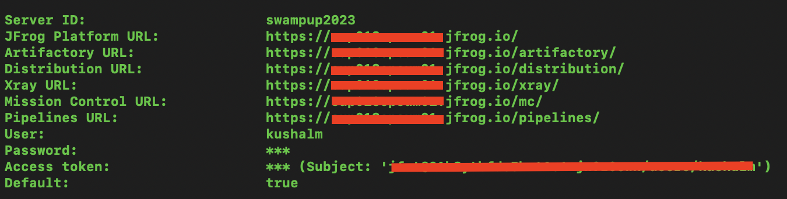

# Introduction to DevSecOps with JFrog Xray

## Course Objective
Securing your software supply chain is an increasingly complex problem with evolving attack methods and a mix of security point solutions, which can leave you with security blind spots and gaps across your supply chain. This training will discuss how JFrog Xray can help with DevSecOps, how it integrates with the JFrog Platform to secure builds and artifacts, and how to create different policies for different stages of the CI/CD process. We’ll show how to use Xray’s integration with IDEs and CI Servers to reduce risk, speed up development, and ensure reliability in production.

## By the end of this training, you should be able to:
Understand the impact of these components on production system quality, performance, and architectural changes
How to use Xray’s integration with IDEs and CI Servers to reduce risk, speed up development, and ensure reliability in production
Identify container security, why it’s different, and how to streamline security and governance for cloud-native apps
Roll out security best practices throughout their organization

## Who should attend?
Developers
Release Managers
Automation Engineers
DevOps Engineers and Software Security Personnel who want to gain a basic understanding of JFrog Xray

## Agenda
- Lab 1 - Indexing Resources and Create Policy
- LAB 2 - Create Watch and check for violation
- LAB 3 - Package Build Integration
- Lab 4 - Exploring JFrog Advanced Security

 

## Prerequisites
- A SAAS Instance of JFrog Platform. This will be provided as part of your enrollment to the Training class.
- Validate if JFrog CLI is installed on your designated EC2 instance by running `jf -v` validate the version.
  - If not, follow instructions from https://jfrog.com/getcli/ 
- Validate if JFrog CLI is configured by running `jf c show` on the EC2 instance.
      
  -  If not, update HOSTNAME, USERNAME & PASSWORD within `./scripts/_setupCLI.sh` and run it.
- A folder titled SwampUp2023 should exist with the course content
  - run `ls -l` to validate.
  - when instructed, if needed, run the following to update the contents.
    - `cd SwampUp2023`
    - `git pull` 
- Make sure set of repositories appear in your JFrog Platform.
  -  If not, please run `./scripts/create_repo_rescue.sh` to create those repositories created. 
- Please let us know if you need help.

 
