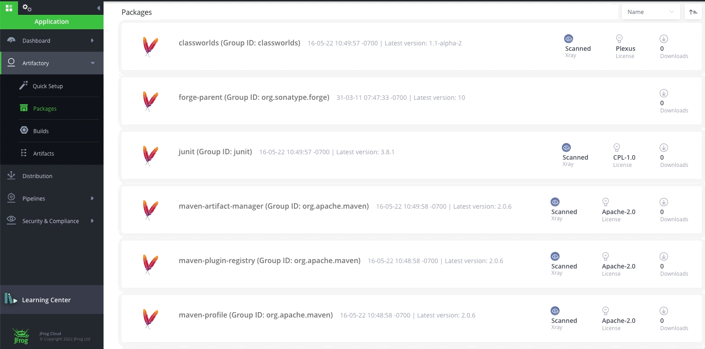
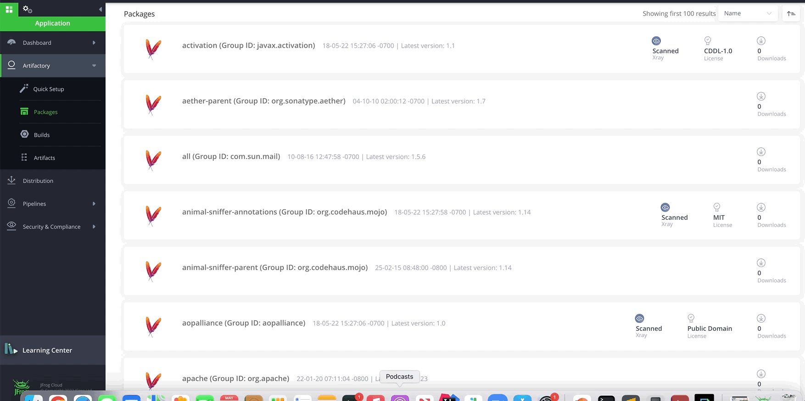

# Lab1 - Indexing Resources and Create Policy
- Prerequisites
- Index Repositories
- Index Builds
- Create Security Policy
- Create License Policy

<br/>

## Prerequisites
- A SAAS Instance of JFrog Platform. This will be provided as part of your enrollment to the Training class.
- Validate if JFrog CLI is installed on your designated EC2 instance by running `jf -v` validate the version.
  - If not, follow instructions from https://jfrog.com/getcli/ 
- Validate if JFrog CLI is configured by running `jf c show` on the EC2 instance.
      
  -  If not, update HOSTNAME, USERNAME & PASSWORD within `./scripts/_setupCLI.sh` and run it.
- A folder titled SwampUp2023 should exist with the course content
  - run `ls -l` to validate.
  - when instructed, if needed, run the following to update the contents.
    - `cd SwampUp2023`
    - `git pull` 
- Make sure set of repositories appear in your JFrog Platform.
  -  If not, please run `./scripts/create_repo_rescue.sh` to create those repositories created. 
- Please let us know if you need help. 

<br/>

## INDEX REPOSITORIES 
### INDEX REPOSITORIES using UI

- Login to your saas instance **{{instance_name}}**.jfrog.io with  your admin credentials

- Navigate to the **Administration** Module, **Xray** and click on Settings then **Indexed Resources**

- Add the **Repositories** resources to get indexed

  

<br/>

### INDEX REPOSITORIES using AUTOMATION [Optional]
- Run 
```
  jf xr curl -XPUT "/api/v1/binMgr/1/repos" -H "Content-Type: application/json" -d "@./json/index-repos.json"
  
```

<br/> 

## INDEX BUILDS 
### INDEX BUILDS using UI
- Add **Builds** resources to get indexed
  
  

<br/>

### INDEX BUILDS using AUTOMATION [Optional]
- Run 
```
  jf xr curl -XPUT "/api/v1/binMgr/1/builds" -H "Content-Type: application/json" -d "@./json/index-builds.json"
```

<br/>
<br/>
<br/>

## CREATE SECURITY POLICY
### CREATE A SECURITY POLICY using UI (NEW or OLD ??????)
- Navigate to the **Administration** Module, expand the **Xray** menu at the bottom and click on **Watches & Policies** menu item.
- Click on **Create a Policy** and let's create our first **Security** policy called **"prod-security-policy"**
  
  

<br/>

- Click on **New Rule** to add rules to **prod-security-policy**. Add the following rule with **Criteria** and **Automatic Actions**. A default Automatic Action of Generate Violation is enabled for every Rule. Click **Save** and Click **Create**.
  * **Rule name**: high
  * **Criteria**: Minimum Severity: High
  * **Automatic Actions**: 
    * Notify Deployer
    * Block Download 
    * Fail Build
  
  

<br/>

### CREATE A SECURITY POLICY using AUTOMATION [Optional]
- Run
```
  jf xr curl -XPOST "/api/v2/policies" -H "Content-Type: application/json" -d "@./json/prod-sec-policy.json"
```
  - With Severity - CRITICAL, HIGH, MEDIUM, LOW with different action items
- Confirm Security Policy named with ``prod-security-policy`` is created

<br/>

## CREATE LICENSE POLICY
### CREATE A LICENSE POLICY using UI
- Click on **New Policy**. Let's create a **License** policy with **"prod-license-policy"** name.
 
  

<br/>

- Click on **New Rule** to add rule to **prod-license-policy**. Add a Rule for banned licenses with **Criteria** and **Automatic Actions** below. Click **Save** and Click **Create**.
  * **Rule name**: banned
  * **Criteria**: Banned Licenses: "GPL-1.0, GPL-1.0+ ,GPL-1.0-or-later, GPL-3.0, GPL-2.0"
  * **Automatic Actions**:
    * Notify Deployer
    * Block Download
    * Fail Build
  
  
  
**NOTE:** You may have noticed that Fields under **Criteria** are different for **License Policy** and for **Security Policy**.  

<br/>

### CREATE A LICENSE POLICY using AUTOMATION [Optional]
- Run 
```
  jf xr curl -XPOST "/api/v2/policies" -H "Content-Type: application/json" -d "@./json/prod-lic-policy.json"
```
- Confirm License Policy named with ``prod-license-policy`` is created

<br/>
<br/>
<br/>

## CREATE OPERATIONAL RISK POLICY
### CREATE A OPERATIONAL RISK POLICY using UI
- Click on **New Policy**. Let's create a **Operational Risk** policy with **"prod-operational-risk-policy"** name.
 
  

<br/>

- Click on **New Rule** to add rule to **prod-operational-risk-policy**. Add a Rule for banned licenses with **Criteria** and **Automatic Actions** below. Click **Save** and Click **Create**.
  * **Rule name**: high
  * **Criteria**: 
      * Custom Condition: 
          * Check Is End-of-Life?
          * Risk Severity: High
  * **Automatic Actions**:
    * Notify Deployer
    * Block Download
    * Fail Build
  
  
  
**NOTE:** You may have noticed that Fields under **Criteria** are different for **Operational Risk Policy** from the other 2 types.  

<br/>

### CREATE A OPERATIONAL RISK POLICY using AUTOMATION [Optional]
- Run 
```
  jf xr curl -XPOST "/api/v2/policies" -H "Content-Type: application/json" -d "@./json/operational-risk-policy.json"
```
- Confirm Operational Policy named with ``prod-operational-risk-policy`` is created
