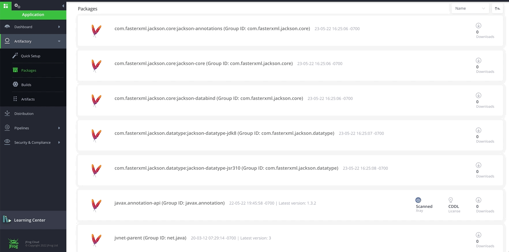
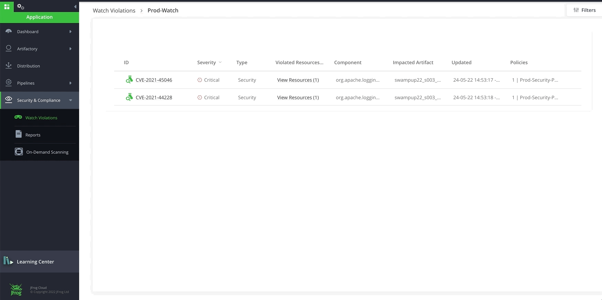

# Lab3 - Xray at CI/CD 
- Prerequisites
- Xray at CI/CD

## Prerequisites
- A SAAS Instance of JFrog Platform. This will be provided as part of your enrollment to the Training class.
- Lab-1 and Lab-2  completed.
- JFrog CLI is installed on your machine by running `jf -v`

<br/>

## Xray at CI/CD
- One of the Package Manager Integration we can use

#### MAVEN

### Package Manager Integration
JFTD104-Intro_to_DevSecOps_with_JFrog_Xray/lab-3/project-examples/
- `cd JFTD104-Intro_to_DevSecOps_with_JFrog_Xray/lab-3/project-examples/maven-vulnerable-example`
- To pre-configured with the Artifactory server, repositories and use for building and publishing. The configuration is stored by the command in the .jfrog directory at the root directory of the project.)
  - Run 
  ```
  jf mvnc --repo-resolve-snapshots jftd104-libs-snapshot-virtual --repo-resolve-releases jftd104-libs-release-virtual --repo-deploy-snapshots jftd104-libs-snapshot-virtual --repo-deploy-releases jftd104-libs-release-virtual
  ```
- Run ``jf mvn clean install -f ./pom.xml -Dmaven.test.skip=true -Dartifactory.publish.artifacts=true --build-name swampup23_jftd104_mvn_pipeline --build-number 1.0.0``

### COLLECT ENVIRONMENT VARIABLES

- Run

  ``jf rt build-collect-env swampup23_jftd104_mvn_pipeline 1.0.0``

  or

  ``jf rt bce swampup23_jftd104_mvn_pipeline 1.0.0``

### COLLECT INFORMATION REGARDING GIT

- Run

  ``jf rt build-add-git swampup23_jftd104_mvn_pipeline 1.0.0`` - (.git path[Optional] - Path to a directory containing the .git directory. If not specific, the .git directory is assumed to be in the current directory or in one of the parent directories.)

  or

  ``jf rt bag swampup23_jftd104_mvn_pipeline 1.0.0``


### PUBLISH BUILD-INFO

- Run ``jf rt bp swampup23_jftd104_mvn_pipeline 1.0.0``

### SCAN BUILD
- Scan a published build-info with Xray using **jf build-scan**
```
  jf bs swampup23_jftd104_mvn_pipeline 1.0.0
```

- Additional commands, `--vuln`, `--fail`, `--format`, [more](https://www.jfrog.com/confluence/display/CLI/CLI+for+JFrog+Xray#CLIforJFrogXray-ScanningPublishedBuilds)
- Xray should fail the build with the following raised security violations
  
  | SEVERITY | IMPACTED PACKAGE | IMPACTED PACKAGE VERSION | TYPE  | FIXED VERSIONS | COMPONENT | COMPONENT VERSION | CVE |
  | -------- | ---------------- | ------------------------ | ----- | -------------- | --------  | ----------------- | -------- |
  | 🔥High   | org.apache.logging.log4j:log4j-core | 2.14.1 | Maven | [2.12.2] [2.15.0] [2.3.1] | org.apache.logging.log4j:log4j-core | 2.14.1  | CVE-2021-44228 |
  | 🎃Medium | org.apache.logging.log4j:log4j-core | 2.14.1 | Maven | [2.12.2] [2.16.0] [2.3.1] | org.apache.logging.log4j:log4j-core | 2.14.1  | CVE-2021-45046 |

  | No license compliance violations were found |
  | ----- |
<br />

- See violations in the Artifactory UI. Navigate to **Application** > **Security & Compliance** > **Watch Violations**. You will be able to see the watches that we have created in Step 1. Click on the `prod-watch`. The Violations tab in a Watch is the central location for viewing the detected violations based on the policies and rules you have predefined on the Watch. You can view the list of the violations, search for violations according to filters, set ignore rules and edit the Watch in the Settings tab.

  

- **Ignore Violation** by navigating to **Application** > **Security & Compliance** > **Watch Violation**. Open watch `prod-watch` that we created in STEP 1 and hover your mouse over the right side of a violation.

  

### RESCAN BUILD AFTER UPDATE VERSION OF VULNERABLE DEPENDENCIES 

- Follow the same sequence of steps as above to run a successful build this time.

- This time the build should succeed with the following message


| No security violations were found |
| ----------- |

| No license compliance violations were found |
| -------- |


#### NPM

### Package Manager Integration
- `cd JFTD104-Intro_to_DevSecOps_with_JFrog_Xray/lab-3/project-examples/npm-vulnerable-example`
- To pre-configured with the Artifactory server, repositories and use for building and publishing. The configuration is stored by the command in the .jfrog directory at the root directory of the project.)
  - Run 
  ```
  jf npmc --repo-resolve jftd104-npm-virtual --repo-deploy jftd104-npm-virtual 
  ```
- Run ``jf npm install --build-name swampup23_jftd104_npm_pipeline --build-number 1.0.0``
- Run ``jf npm publish --build-name swampup23_jftd104_npm_pipeline --build-number 1.0.0`` - Publish build Artifact to repository

### COLLECT ENVIRONMENT VARIABLES

- Run ``jf rt bce swampup23_jftd104_npm_pipeline 1.0.0``

### COLLECT INFORMATION REGARDING GIT

- Run ``jf rt bag swampup23_jftd104_npm_pipeline 1.0.0``  - (.git path[Optional] - Path to a directory containing the .git directory. If not specific, the .git directory is assumed to be in the current directory or in one of the parent directories.)

### PUBLISH BUILD-INFO

- Run ``jf rt bp swampup23_jftd104_npm_pipeline 1.0.0``

### SCAN BUILD
- Scan a published build-info with Xray using **jf build-scan**
  ```
  jf bs swampup23_jftd104_npm_pipeline 1.0.0
  ```
- Additional commands, `--vuln`, `--fail`, `--format`, [more](https://www.jfrog.com/confluence/display/CLI/CLI+for+JFrog+Xray#CLIforJFrogXray-ScanningPublishedBuilds)
- Xray should fail the build with the following raised security violations
  
  | SEVERITY | IMPACTED PACKAGE | IMPACTED PACKAGE VERSION | TYPE  | FIXED VERSIONS | COMPONENT | COMPONENT VERSION | CVE |
  | -------- | ---------------- | ------------------------ | ----- | -------------- | --------  | ----------------- | -------- |
  | 🔥High   | org.apache.logging.log4j:log4j-core | 2.14.1 | Maven | [2.12.2] [2.15.0] [2.3.1] | org.apache.logging.log4j:log4j-core | 2.14.1  | CVE-2021-44228 |
  | 🎃Medium | org.apache.logging.log4j:log4j-core | 2.14.1 | Maven | [2.12.2] [2.16.0] [2.3.1] | org.apache.logging.log4j:log4j-core | 2.14.1  | CVE-2021-45046 |

  | No license compliance violations were found |
  | ----- |

<br />

- See violations in the Artifactory UI. Navigate to **Application** > **Security & Compliance** > **Watch Violations**. You will be able to see the watches that we have created in Step 1. Click on the `prod-watch`. The Violations tab in a Watch is the central location for viewing the detected violations based on the policies and rules you have predefined on the Watch. You can view the list of the violations, search for violations according to filters, set ignore rules and edit the Watch in the Settings tab.

  

- **Ignore Violation** by navigating to **Application** > **Security & Compliance** > **Watch Violation**. Open watch `prod-watch` that we created in STEP 1 and hover your mouse over the right side of a violation.

  

### RESCAN BUILD AFTER UPDATE VERSION OF VULNERABLE DEPENDENCIES 

- Follow the same sequence of steps as above to run a successful build this time.

- This time the build should succeed with the following message


| No security violations were found |
| ----------- |

| No license compliance violations were found |
| -------- |