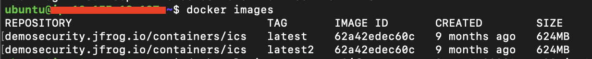

# Lab4 - Advanced Security
- Prerequisites
- Advanced Security

## Prerequisites
- A SAAS Instance of JFrog Platform. This will be provided as part of your enrollment to the Training class.

<br/>

## Explore
- Navigate to `XRay -> Scans List -> containers -> ics/latest -> Security Issues -> Vulnerabilities`.
- Find `CVE-2020-9546` in the search box to the right of the screen
  - Is it applicable to this docker image?
  - What is the risk?
  - What is the remediation process?
- Now look at `CVE-2017-5645`
  - Note the CVSS score of 9.8!
  - Why is it not applicable to this docker image?
- What about Secrets?
  - If not available, click on `Scan for Exposures` and examine results.
 
 <br/>

## Interact
- SSH into your EC2 instance and execute the commands
  - View available docker images
  ```
  docker images
  ```
  - You should see as follows
  
  
  - docker login
  ```
  docker login -u ${username} -p ${password} ${instance}.jfrog.io
  ```
  - docker tagging
  ```
  docker tag demosecurity.jfrog.io/containers/ics:latest2 ${instance}.jfrog.io/containers/ics:latest2
  ```
  - docker push
  ```
  docker push ${instance}.jfrog.io/containers/ics:latest2
  ```
- Explore and Examine results.